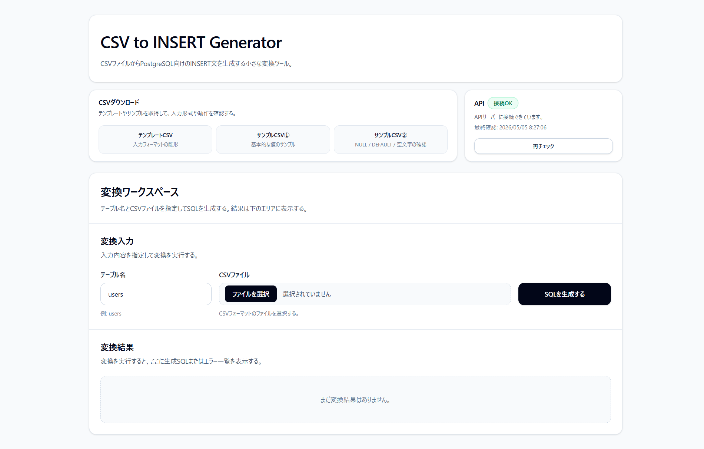
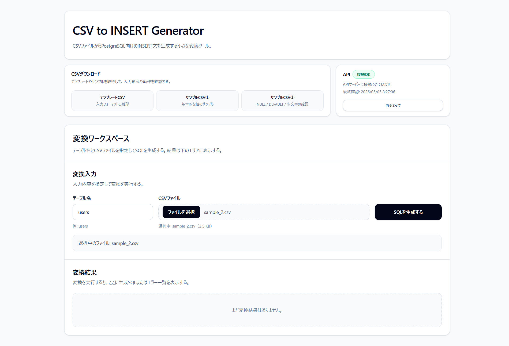
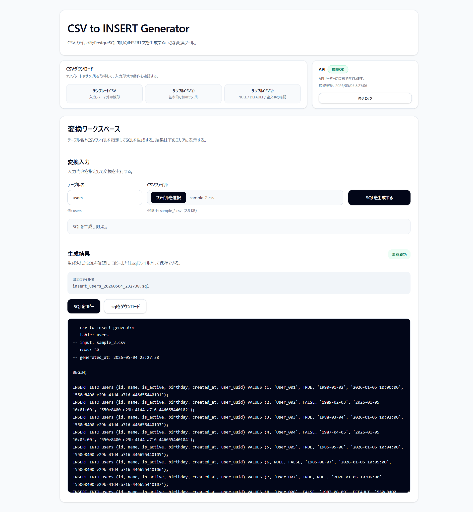

# CSV to INSERT Generator

<p>
  <a href="https://csv-to-insert-generator.vercel.app/">
    
  </a>
</p>

<p>
  
  
  
  
  
  
</p>

<p>
  
  
  
  
  
</p>

CSV ファイルから PostgreSQL 向けの `INSERT` 文 SQL を生成する Web ツール。  
画面からテーブル名と CSV ファイルを指定して変換を実行し、生成された SQL を画面表示・コピー・`.sql` ダウンロードできる。  
入力値に不備がある場合は SQL を生成せず、行番号・列名・型・入力値・理由を一覧表示する。

- バックエンド：Render（Java 21 / HttpServer / Dockerfile）
- フロントエンド：Vercel（React + TypeScript + Vite）
- DB：使用なし（ステートレス）

---

## デモ

[](https://csv-to-insert-generator.vercel.app/)

- [`アプリURL`](https://csv-to-insert-generator.vercel.app/)（Vercel）：`https://csv-to-insert-generator.vercel.app/`

> Render の環境では、一定時間アクセスがないと **コールドスタート**が発生し、初回応答に時間がかかる場合がある。  
> 本アプリでは、画面上で API の接続状態を確認できるようにしている。

---

## スクリーンショット

1. 初期表示
   

2. CSVファイル選択後
   

3. CSV 変換成功 / SQL 表示
   

---

## できること

- `/healthz` による API ヘルスチェック
  - 画面初回表示で自動チェック
  - 手動の再チェックにも対応
- テンプレート CSV のダウンロード
- サンプル CSV のダウンロード
- テーブル名と CSV ファイルを指定して `/convert` を実行
- PostgreSQL 向けの `INSERT` 文 SQL を生成
- 生成 SQL を画面表示
- 生成 SQL をクリップボードにコピー
- 生成 SQL を `.sql` ファイルとしてダウンロード
- 入力不正時にエラー一覧を表示

---

## この開発を通した学習目的

小規模な業務改善ツールを題材に、バックエンド・フロントエンド・デプロイまで一通り実装することを目的とした。

- Java 標準 `HttpServer` による API 実装
- フレームワークを使わないルーティング / ハンドラ / CORS 制御
- CSV パース、値の解釈、型検証、SQL 生成の責務分割
- Apache Commons CSV / Apache Commons FileUpload / Jackson の利用
- React + TypeScript + Tailwind CSS v4 による UI 実装
- Render + Vercel の分離デプロイ
- Dockerfile によるバックエンドのコンテナ化

---

## CSV フォーマット例

入力 CSV は、型情報とカラム情報を含む専用フォーマットを使用する。

```csv
#table=users
#types=int,text,bool,date,timestamp,uuid
id,name,is_active,birthday,created_at,user_uuid
1,Alice,true,1990-01-02,2026-01-05 10:00:00,550e8400-e29b-41d4-a716-446655440000
```

画面で入力したテーブル名が、変換時のテーブル名として使用される。  
CSV 内に `#table=...` がある場合も、画面入力のテーブル名に合わせて処理する。

対応する型：

- `text`
- `int`
- `decimal`
- `bool`
- `date`
- `timestamp`
- `uuid`

値の扱い：

- 空欄 / `NULL`：`NULL`
- `DEFAULT`：`DEFAULT`
- `""`：空文字（`text` 型のみ許可）

---

## 前提条件

- バックエンド：：Java 21 + Maven + Docker Desktop（Docker でバックエンドを確認する場合）
- フロントエンド：Node.js + npm

---

## クイックスタート

### 1) バックエンド起動

```bash
cd backend
mvn test
```

ローカルで直接起動する場合：

```bash
mvn exec:java
```

Docker で起動する場合：

```bash
docker build -t csv-to-insert-generator-backend ./backend
docker run --rm -p 8080:10000 --name csv-to-insert-generator-backend csv-to-insert-generator-backend
```

- 既定：`http://localhost:8080`

ヘルスチェック：

```bash
curl -i http://localhost:8080/healthz
```

### 2) フロントエンド起動

```bash
cd frontend
npm install
```

`.env.local.example` をコピーして `.env.local` を作成。

```bash
cp .env.local.example .env.local
```

Windows（PowerShell）の場合：

```powershell
Copy-Item .env.local.example .env.local
```

`.env.local` にバックエンドの URL を設定。

```env
VITE_API_BASE_URL=http://localhost:8080
```

開発サーバを起動。

```bash
npm run dev
```

- 既定：`http://localhost:5173`

---

## 使い方

1. 画面上部で API の接続状態を確認する
2. 必要に応じてテンプレート CSV またはサンプル CSV をダウンロードする
3. テーブル名を入力する
4. CSV ファイルを選択する
5. 「SQLを生成する」を押す
6. 成功時は SQL をコピー、または `.sql` としてダウンロードする
7. 失敗時はエラー一覧を確認し、CSV を修正する

---

## 環境変数

### Backend

- `PORT`
  - 待受ポート
  - Render では自動設定される想定
  - 未設定時は `8080`
- `ALLOWED_ORIGINS`
  - CORS で許可するフロントエンドの Origin
  - カンマ区切りで複数指定

例：

```env
ALLOWED_ORIGINS=http://localhost:5173,https://<YOUR_VERCEL_APP>.vercel.app
```

### Frontend（Vite）

- `VITE_API_BASE_URL`
  - バックエンド API のベース URL
  - ローカル例：`http://localhost:8080`
  - 本番例：Render の API URL

例：

```env
VITE_API_BASE_URL=http://localhost:8080
```

---

## API 概要

> 詳しい仕様は `/docs` を参照。

- `GET /healthz`
  - API の起動確認
- `GET /template.csv`
  - テンプレート CSV を返却
- `GET /sample1.csv`
  - サンプル CSV ① を返却
- `GET /sample2.csv`
  - サンプル CSV ② を返却
- `POST /convert`
  - CSV を SQL に変換

`POST /convert` は `multipart/form-data` で送信する。

必須フィールド：

- `table`
- `file`

curl 例：

```bash
curl -i -X POST http://localhost:8080/convert \
  -F "table=users" \
  -F "file=@backend/src/main/resources/samples/sample_1.csv;type=text/csv"
```

---

## テスト / ビルド

### Backend（JUnit）

```bash
cd backend
mvn test
```

### Frontend

```bash
cd frontend
npm run build
```

---

## ディレクトリ構成（概要）

```bash
.
├─ backend/   # Java HttpServer API
├─ frontend/  # Vite + React UI
└─ docs/      # 要件・仕様、設計など
```

---

## デプロイ（概要）

### バックエンド（Render）

- `backend/Dockerfile` でビルドして起動
- 環境変数に `ALLOWED_ORIGINS` を設定
- Vercel の本番 URL を CORS 許可 Origin に含める

### フロントエンド（Vercel）

- Root Directory：`frontend`
- Build Command：`npm run build`
- Output Directory：`dist`
- 環境変数 `VITE_API_BASE_URL` に Render の URL を設定

---

## 技術スタック

### Backend

- Java 21
- Maven
- Java 標準 `HttpServer`
- Apache Commons CSV
- Apache Commons FileUpload
- Jackson
- JUnit 5

### Frontend

- TypeScript
- React
- Vite
- Tailwind CSS v4

### Deploy

- Render（バックエンド：Dockerfile デプロイ）
- Vercel（フロントエンド：Vite ビルド成果物をデプロイ）

---

## ドキュメント

ドキュメントは `/docs` にまとめている。

- 要件・仕様まとめ：[`docs/01-requirements.md`](docs/01_requirements.md)
- 設計：[`docs/02_architecture.md`](docs/02_architecture.md)
